# 🌍 Tourism Dataset — Data Analysis Project

Exploratory data analysis and visualization of a global tourism dataset (41,923 records) covering visitor counts, revenue, ratings, categories, and accommodation availability across multiple countries.

## 📊 Dataset Overview

| Column | Description |
|---|---|
| `Location` | Name/ID of the tourist location |
| `Country` | Country where the location is situated |
| `Category` | Type of attraction (Nature, Historical, Cultural, etc.) |
| `Visitors` | Number of visitors |
| `Rating` | Average visitor rating |
| `Revenue` | Revenue generated |
| `Accommodation_Available` | Whether accommodation is available (Yes/No) |

**Rows:** 41,923 | **Columns:** 7

---

## 📈 Visualizations

### 1. 2D Density Plot — Visitors vs Revenue
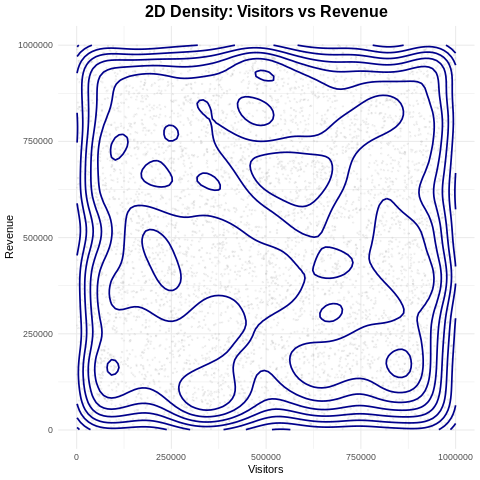

### 2. Average Revenue by Category
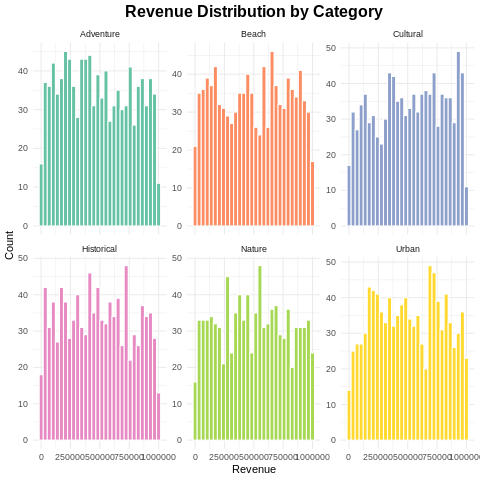

### 3. Cumulative Revenue by Category
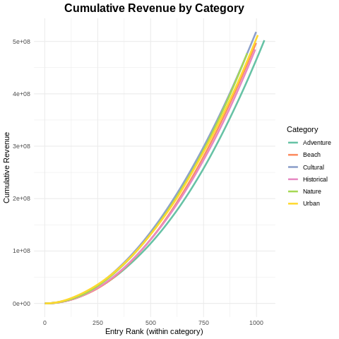

### 4. Category Distribution
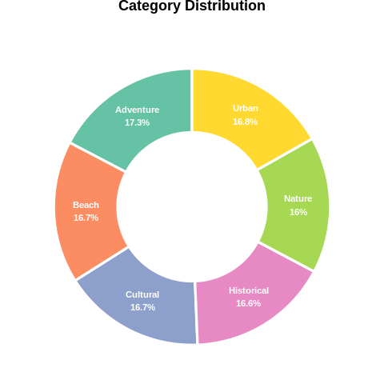

### 5. Top 10 Locations by Revenue
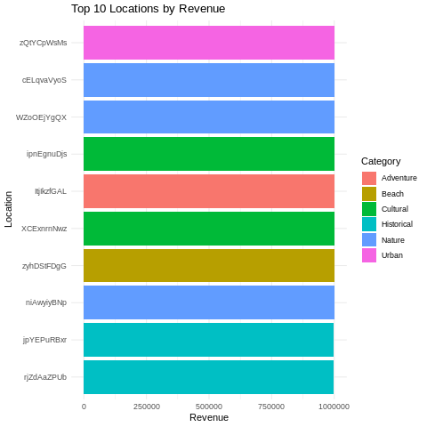

### 6. Visitors vs Revenue (Bubble Chart)
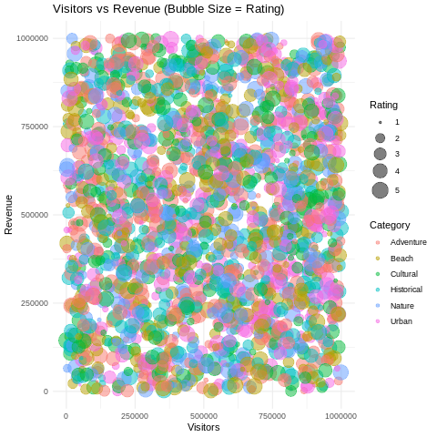

### 7. Accommodation Availability by Category
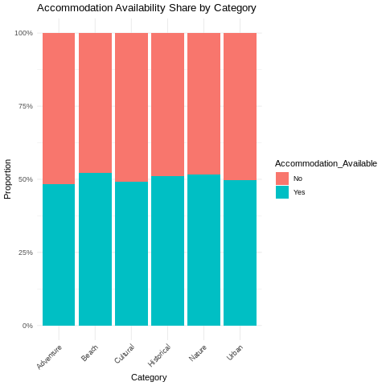

### 8. Visitors vs Revenue — Faceted by Category
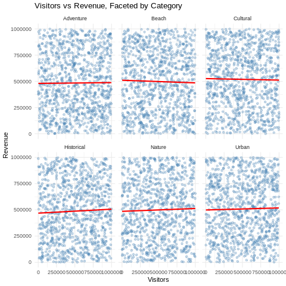

### 9. Revenue Trend
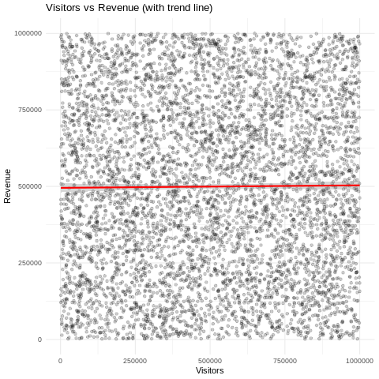

### 10. Top 10 Countries by Visitors
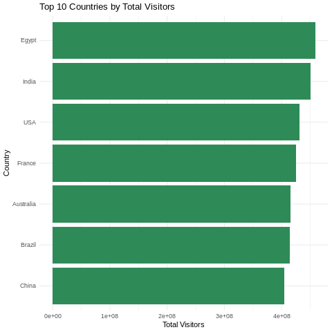

### 11. Revenue Distribution — Violin + Box Plot
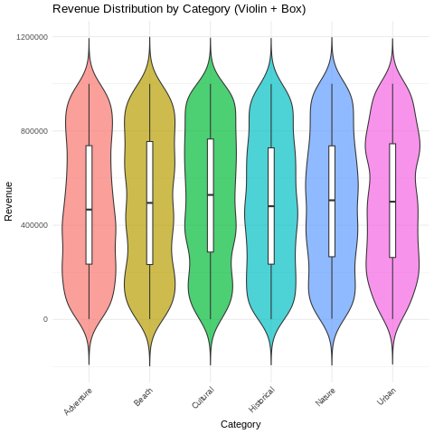

### 12. Visitors Distribution
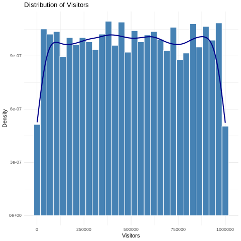

---

## 🛠️ Tools Used

- **R** — `ggplot2`, `dplyr`, `treemapify`, `ggridges`
- **Google Colab** (R runtime via `rpy2`)

## 📁 Project Structure


## 🚀 How to Reproduce

1. Clone this repository
2. Open `tourism_dataset.csv` in Google Colab (R runtime, or Python + `rpy2`)
3. Install required packages:
   ```r
   install.packages(c("ggplot2", "dplyr", "treemapify", "ggridges"))
   ```
4. Run the analysis scripts to regenerate the charts

---

⭐ If you found this analysis useful, consider giving the repo a star!
